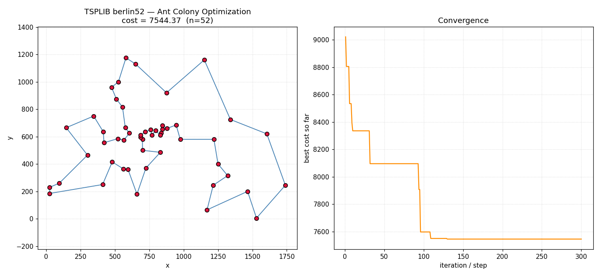

# TSP Solver & Benchmark Suite

[](https://github.com/IlkerGcr/TSP_Solver/actions/workflows/ci.yml)

A Python framework for solving the Traveling Salesman Problem (TSP) with
multiple algorithms, validated against [TSPLIB](http://comopt.ifi.uni-heidelberg.de/software/TSPLIB95/)
benchmark instances and tuned via a parallel hyperparameter grid search.

## Algorithms implemented
- **Exact** — Held–Karp dynamic programming (optimal, for small instances) and a Branch & Bound brute-force solver with nearest-neighbor bounding and symmetry pruning.
- **Simulated Annealing (SA)** — with automatic initial-temperature estimation and O(1)-delta 2-opt moves.
- **Ant Colony Optimization (ACO)** — configurable pheromone/heuristic weighting, evaporation, pheromone clamping, and optional 2-opt local search on the iteration-best tour.

## Results

### Validated against TSPLIB (externally published optimal tours)

| Instance | n | Published optimum | SA (best of 5) | ACO (best of 5) |
|---|---|---|---|---|
| [berlin52](data/tsplib/berlin52.tsp) | 52 | 7542 | 7785.98 (+3.23%) | **7544.37 (+0.03%)** |
| [st70](data/tsplib/st70.tsp) | 70 | 675 | 707.47 (+4.81%) | **677.11 (+0.31%)** |

Source: [TSPLIB](https://github.com/mastqe/tsplib), citing Reinelt, G. "TSPLIB — A
Traveling Salesman Problem Library." *ORSA Journal on Computing*, 3(4), 1991.
Reproduce with `python src/experiments/run_tsplib_benchmark.py`.

<p align="center">
  
</p>

### Optimality gap on small instances (Held-Karp ground truth)

Across 9 tiny instances (10–14 cities), each solved with 5 random seeds:

| Algorithm | Best-of-5 vs. optimal | Single-run vs. optimal |
|---|---|---|
| ACO | **exact optimum, 9/9 instances** | exact optimum, 9/9 instances |
| SA | +3.0% on average | +7.7% on average |

### Quality vs. speed trade-off (200-city instances)

| Algorithm | Avg. tour cost vs. the other | Avg. runtime |
|---|---|---|
| ACO | 4.3% shorter tours | 89.1s |
| SA | 4.3% longer tours | 6.4s (**13.8x faster**) |

### Parallel grid search

Tuning SA/ACO hyperparameters with `ProcessPoolExecutor` across all CPU cores
cut an 18-task tuning workload from 34.9s (serial) to 4.6s — a **7.6x speedup**
on a 32-core machine.

*(Full methodology and raw numbers: [`data/results/`](data/results/).)*

## Structure
```
src/tsp/         core data structures: TSPInstance (coords + distance matrix, JSON load/save),
                 tour cost, O(1)-delta 2-opt moves, exact solvers, TSPLIB loader
src/solvers/     SA and ACO solver implementations
src/experiments/ instance generation, parallel grid-search tuning, benchmark runners, plotting
src/cli.py       `tsp solve` command-line entry point
app/             Streamlit live demo
tests/           pytest suite (unit tests + solver correctness checks)
data/instances/  pre-generated problem instances (10 to 200 cities) + converted TSPLIB instances
data/tsplib/     raw TSPLIB .tsp files and their published optimal tour lengths
data/results/    benchmark run outputs
data/plots/      tour + convergence visualizations
data/best_params.json   tuned hyperparameters found by grid search
```

## Running it

### Install
```bash
pip install -e ".[dev,viz]"      # core + tests + matplotlib plotting
# or, without an editable install:
pip install -r requirements.txt
```

### CLI
```bash
tsp solve --instance data/instances/tsplib_berlin52.json --algo aco
tsp solve --instance data/instances/tiny_n10_seed1.json --algo exact --output result.json
```

### Scripts
```bash
# Generate problem instances
python src/experiments/generate_instances.py

# Tune SA/ACO parameters via parallel grid search (uses ProcessPoolExecutor)
python src/experiments/run_grid_search.py

# Validate against TSPLIB benchmark instances
python src/experiments/run_tsplib_benchmark.py

# Plot a solved tour + its convergence curve
python src/experiments/plot_solution.py --instance data/instances/tsplib_berlin52.json --algo aco

# Run the test suite
pytest
```

## Live demo

An interactive Streamlit app lets you pick an instance, run SA or ACO, and
replay how the solution converged.

**Run locally:**
```bash
pip install -e ".[demo]"
streamlit run app/streamlit_app.py
```

**Deploy for free on [Streamlit Community Cloud](https://streamlit.io/cloud):**
1. Go to [share.streamlit.io](https://share.streamlit.io) and sign in with GitHub.
2. "New app" → select this repo/branch → set the main file path to `app/streamlit_app.py`.
3. Deploy. Streamlit Cloud installs from `requirements.txt` automatically.

## Highlights
- Exact Held–Karp DP solver for verifying optimal solutions on small instances.
- Results validated against TSPLIB's externally published optimal tours, not just self-generated instances.
- Hyperparameter tuning is parallelized across CPU cores and picks the fastest configuration within a cost tolerance of the best found (not just the lowest-cost one).
- Instances range from 10 to 200 cities across four size categories (tiny/small/medium/large), plus TSPLIB benchmarks.

## Tech stack
Core solvers (`src/tsp`, `src/solvers`) and the CLI are pure Python 3 standard
library (dataclasses, `concurrent.futures`, `argparse`) — no dependencies to
run the algorithms themselves. `matplotlib` is used for plotting, `pytest`
for tests, and `streamlit` for the optional live demo.
